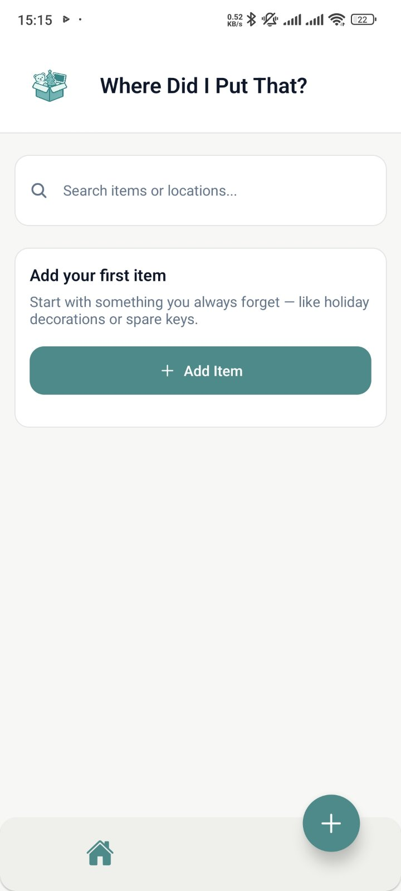

# Where Did I Put That?

A minimalist React Native + Expo mobile app for tracking where you store household items.

**Tech Stack:** Expo SDK 54 · React Native 0.81 · SQLite (local DB) · NativeWind (Tailwind CSS)

### Features

- Add, edit, delete, and search stored items
- Local persistence with SQLite
- Undo deletion (snackbar countdown)
- Clean, responsive UI using NativeWind

### Run locally

```bash
npm install
npm run start
```

---

### Screenshots

#### Home Screen


#### Add Item


#### Welcome Screen



### Documentation

See the `/docs` folder:

- `docs/00-mvp.md` – MVP definition
- `docs/01-user-stories.md` – user stories
- `docs/02-data-model.md` – data model
- `docs/03-roadmap.md` – roadmap

## License

MIT
